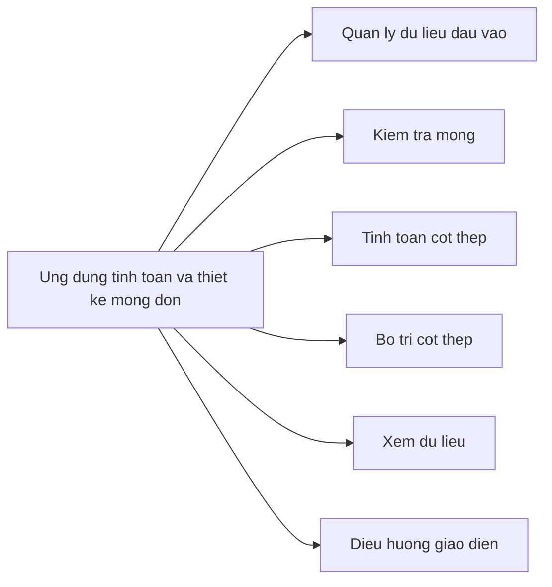
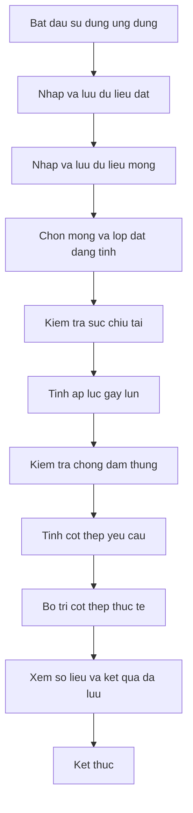

# Bieu do phan ra chuc nang ung dung tinh toan va thiet ke mong don

## 1. Bieu do phan ra chuc nang tong quat

```mermaid
flowchart TD
    F0["0. He thong tinh toan va thiet ke mong don"]

    F0 --> F1["1. Quan ly du lieu dau vao"]
    F0 --> F2["2. Kiem tra dieu kien lam viec cua mong"]
    F0 --> F3["3. Tinh toan cot thep mong"]
    F0 --> F4["4. Bo tri cot thep"]
    F0 --> F5["5. Xem va quan ly du lieu da luu"]
    F0 --> F6["6. Dieu huong va dieu khien giao dien"]

    F1 --> F11["1.1 Nhap thong so lop dat"]
    F1 --> F12["1.2 Them va xoa lop dat"]
    F1 --> F13["1.3 Chon lop dat dang tinh"]
    F1 --> F14["1.4 Nhap thong so mong"]
    F1 --> F15["1.5 Chon mong dang tinh"]
    F1 --> F16["1.6 Kiem tra va chuan hoa du lieu nhap"]
    F1 --> F17["1.7 Luu quan he giua mong va lop dat"]

    F2 --> F21["2.1 Kiem tra suc chiu tai nen dat"]
    F2 --> F22["2.2 Tinh ap luc gay lun"]
    F2 --> F23["2.3 Kiem tra chong dam thung"]

    F21 --> F211["2.1.1 Tra he so Terzaghi theo goc ma sat"]
    F21 --> F212["2.1.2 Tinh ap luc trung binh Ptx"]
    F21 --> F213["2.1.3 Tinh suc chiu tai thiet ke Rd"]
    F21 --> F214["2.1.4 Tinh Pmax va Pmin"]
    F21 --> F215["2.1.5 Danh gia dieu kien Ptx va Pmax"]

    F22 --> F221["2.2.1 Lay Ptx tu ket qua suc chiu tai"]
    F22 --> F222["2.2.2 Tinh lai Ptx khi chua co ket qua"]
    F22 --> F223["2.2.3 Tinh Pgl"]

    F23 --> F231["2.3.1 Tinh chieu cao lam viec h0"]
    F23 --> F232["2.3.2 Tinh Po, Pomax, Pomin"]
    F23 --> F233["2.3.3 Tinh ap luc dam thung Pdt"]
    F23 --> F234["2.3.4 Tinh luc chong dam thung Pcdt"]
    F23 --> F235["2.3.5 Danh gia dieu kien Pdt va Pcdt"]

    F3 --> F31["3.1 Lay ket qua chong dam thung"]
    F3 --> F32["3.2 Tinh momen theo phuong canh dai"]
    F3 --> F33["3.3 Tinh dien tich thep yeu cau phuong dai"]
    F3 --> F34["3.4 Tinh momen theo phuong canh ngan"]
    F3 --> F35["3.5 Tinh dien tich thep yeu cau phuong ngan"]
    F3 --> F36["3.6 Luu ket qua tinh cot thep"]

    F4 --> F41["4.1 Nhap duong kinh thep"]
    F4 --> F42["4.2 Nhap khoang cach thep"]
    F4 --> F43["4.3 Tinh so thanh thep"]
    F4 --> F44["4.4 Tinh dien tich thep thuc te"]
    F4 --> F45["4.5 So sanh voi dien tich thep yeu cau"]
    F4 --> F46["4.6 Luu phuong an bo tri"]

    F5 --> F51["5.1 Hien thi thong so mong da luu"]
    F5 --> F52["5.2 Hien thi danh sach lop dat"]
    F5 --> F53["5.3 Luu ket qua trung gian trong bo nho ung dung"]

    F6 --> F61["6.1 Mo trang chu"]
    F6 --> F62["6.2 Chuyen den man hinh nhap du lieu"]
    F6 --> F63["6.3 Chuyen den man hinh kiem tra"]
    F6 --> F64["6.4 Chuyen den man hinh tinh cot thep"]
    F6 --> F65["6.5 Chuyen den man hinh bo tri cot thep"]
    F6 --> F66["6.6 Thoat ung dung"]
```

## 2. Bieu do phan ra chuc nang muc 1

## 3. Bieu do phan ra chuc nang theo quy trinh nghiep vu

## 4. Mo ta cac nhom chuc nang

| Ma chuc nang | Ten chuc nang | Mo ta |
| --- | --- | --- |
| 1 | Quan ly du lieu dau vao | Nhap, them, xoa, chon va luu thong so lop dat, thong so mong, vat lieu va tai trong. |
| 2 | Kiem tra dieu kien lam viec cua mong | Thuc hien cac phep kiem tra suc chiu tai nen dat, ap luc gay lun va chong dam thung. |
| 3 | Tinh toan cot thep mong | Tinh momen va dien tich cot thep yeu cau theo hai phuong cua mong. |
| 4 | Bo tri cot thep | Tinh so thanh, dien tich thep thuc te va so sanh voi dien tich thep yeu cau. |
| 5 | Xem va quan ly du lieu da luu | Hien thi thong so mong, danh sach lop dat va cac ket qua tinh toan trung gian. |
| 6 | Dieu huong va dieu khien giao dien | Dieu khien chuyen trang, chon du lieu dang tinh va thoat ung dung. |

## 5. Anh xa chuc nang voi thanh phan code

| Nhom chuc nang | Thanh phan code chinh |
| --- | --- |
| Quan ly du lieu dau vao | `ThongSoDatViewModel`, `ThongSoMongViewModel`, `DuLieuDat`, `MongDon` |
| Kiem tra suc chiu tai | `SucChiuTaiViewModel`, `SucChiuTai`, `HeSoTraCuu` |
| Tinh ap luc gay lun | `DoLunViewModel`, `DoLun` |
| Kiem tra chong dam thung | `ChongDamThungViewModel`, `ChongDamThung` |
| Tinh toan cot thep | `TinhToanCotThepViewModel`, `TinhToanCotThep` |
| Bo tri cot thep | `BoTriCotThepViewModel`, `CotThepBoTri` |
| Dieu huong va xem du lieu | `MainWindow`, `SolieuWindow` |

## 6. Ghi chu khi dua vao bao cao

- Bieu do phan ra chuc nang tap trung vao viec he thong lam gi, khac voi so do thuat toan tap trung vao cach tinh toan tung buoc.
- Neu can trinh bay ngan gon, co the dung muc 2 trong chuong phan tich he thong.
- Neu can trinh bay chi tiet, dung muc 1 va bang mo ta o muc 4.
