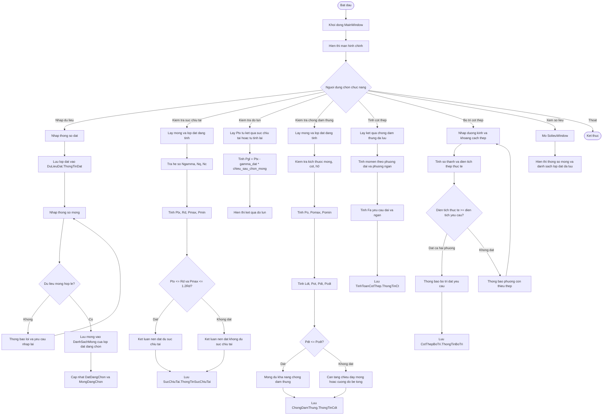
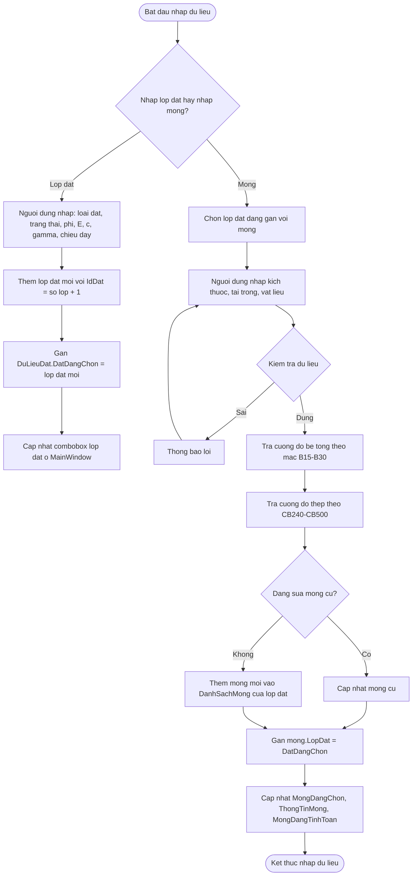
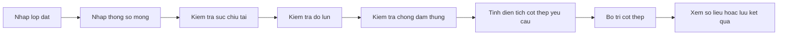

# So do thuat toan ung dung tinh toan va thiet ke mong don

Tai lieu nay tong hop luong xu ly chinh cua ung dung WPF `.NET 8` trong du an `HUCE_DALTUDXD_LOP30_2026_0176667`. Ung dung duoc to chuc theo mo hinh gan MVVM:

- `View/MainWindow.xaml.cs`: dieu huong man hinh, chon lop dat va mong dang tinh.
- `Model/*`: luu cau truc du lieu mong, dat, ket qua tinh toan.
- `ViewModel/*`: chua cac buoc tinh toan va kiem tra.
- `Commands/HeSoTraCuu.cs`: tra he so Terzaghi theo goc ma sat, co noi suy tuyen tinh.

## 1. So do tong quat toan ung dung



## 2. So do nhap va chon du lieu



## 3. So do thuat toan suc chiu tai nen dat

Nguon xu ly chinh: `ViewModel/SucChiuTaiViewModel.cs` va `Commands/HeSoTraCuu.cs`.

```mermaid
flowchart TD
    A([Bat dau tinh suc chiu tai]) --> B[Lay du lieu mong va lop dat]
    B --> C{Kich thuoc mong va gamma dat hop le?}
    C -->|Khong| D[Thong bao du lieu khong hop le]
    D --> Z([Ket thuc])

    C -->|Co| E[Tra he so theo goc ma sat phi]
    E --> F{phi co trong bang tra?}
    F -->|Co| G[Lay truc tiep Ngamma, Nq, Nc]
    F -->|Khong| H[Noi suy tuyen tinh giua 2 goc gan nhat]
    G --> I[Tinh alpha1, alpha2, alpha3]
    H --> I

    I --> J[Tinh Ptx = N/(B*L) + gamma_tb*D]
    J --> K[Tinh Rd theo cong thuc Terzaghi co he so an toan Fs]
    K --> L[Tinh momentTerm = 6*M/(B*L^2)]
    L --> M[Tinh Pmax = Ptx + momentTerm]
    M --> N[Tinh Pmin = Ptx - momentTerm]
    N --> O{Ptx <= Rd?}
    O -->|Khong| P[Nen dat khong du suc chiu tai]
    O -->|Co| Q{Pmax <= 1.2*Rd?}
    Q -->|Khong| P
    Q -->|Co| R[Nen dat du suc chiu tai]
    P --> S[Luu ket qua vao SucChiuTai.ThongTinSucChiuTai]
    R --> S
    S --> Z([Ket thuc])
```

## 4. So do thuat toan do lun hien tai

Trong code hien tai, module do lun moi tinh `Pgl`, chua tinh tong do lun `S`.

```mermaid
flowchart TD
    A([Bat dau tinh do lun]) --> B[Lay mong va lop dat dang tinh]
    B --> C{Da co ket qua suc chiu tai phu hop?}
    C -->|Co| D[Lay Ptx tu SucChiuTai.ThongTinSucChiuTai]
    C -->|Khong| E{B va L cua mong hop le?}
    E -->|Khong| F[Gan Ptx = 0]
    E -->|Co| G[Tinh Ptx = N/(B*L) + gamma_tb*D]
    D --> H[Tinh Pgl]
    F --> H
    G --> H
    H --> I[Pgl = Ptx - gamma_dat * chieu_sau_chon_mong]
    I --> J[Hien thi ket qua Pgl]
    J --> K([Ket thuc])
```

## 5. So do thuat toan chong dam thung

Nguon xu ly chinh: `ViewModel/ChongDamThungViewModel.cs`.

```mermaid
flowchart TD
    A([Bat dau chong dam thung]) --> B[Lay thong so mong, cot, be tong, lop bao ve]
    B --> C{B_mong, L_mong, b_cot, l_cot hop le?}
    C -->|Khong| D[Thong bao kich thuc khong hop le]
    D --> Z([Ket thuc])
    C -->|Co| E[Tinh h0 = chieu_cao_mong - lop_bao_ve]
    E --> F{h0 > 0?}
    F -->|Khong| G[Thong bao h0 khong hop le]
    G --> Z

    F -->|Co| H[Tinh Po = N/(B*L) + gamma_tb*D]
    H --> I[Tinh momentTerm = 6*M/(B*L^2)]
    I --> J[Tinh Pomax = Po + momentTerm]
    J --> K[Tinh Pomin = Po - momentTerm]
    K --> L[Tinh Ldt = (L_mong - L_cot)/2 - h0]
    L --> M[Tinh Pot noi suy tu Pomin den Pomax]
    M --> N[Tinh Pdt = (Pomax + Pot)/2 * Ldt * B_mong]
    N --> O[Tinh Pcdt = Rb*1000*h0*(b_cot + h0)]
    O --> P{Pdt <= Pcdt?}
    P -->|Co| Q[Ket luan mong du chong dam thung]
    P -->|Khong| R[Ket luan khong dat, can tang h hoac Rb]
    Q --> S[Luu ChongDamThung.ThongTinCdt]
    R --> S
    S --> Z([Ket thuc])
```

## 6. So do thuat toan tinh dien tich cot thep yeu cau

Nguon xu ly chinh: `ViewModel/TinhToanCotThepViewModel.cs`. Buoc nay nen thuc hien sau khi da tinh va luu chong dam thung, vi can `Pomax`, `Pomin`, `Po`, `h0`.

```mermaid
flowchart TD
    A([Bat dau tinh cot thep]) --> B[Lay mong, lop dat, ket qua chong dam thung]
    B --> C{Cuong do thep > 0 va h0 > 0?}
    C -->|Khong| D[Thong bao thong so vat lieu khong hop le]
    D --> Z([Ket thuc])

    C -->|Co| E[Tinh theo phuong canh dai]
    E --> F[Lng = L_mong - (L_mong - L_cot)/2]
    F --> G[Pong = Pomin + (Pomax - Pomin)*(L_mong - Lng)/L_mong]
    G --> H[Mlng = (Pong + Pomax)/2 * Lng^2/2 * B_mong]
    H --> I[Fa_dai = Mlng*1000000/(0.9*Rs*h0*1000)]

    I --> J[Tinh theo phuong canh ngan]
    J --> K[Bng = (B_mong - B_cot)/2]
    K --> L[Mbng = Po + Bng^2/2 * L_mong]
    L --> M[Fa_ngan = Mbng*1000000/(0.9*Rs*h0*1000)]
    M --> N[Luu TinhToanCotThep.ThongTinCt]
    N --> Z([Ket thuc])
```

## 7. So do thuat toan bo tri cot thep

Nguon xu ly chinh: `ViewModel/BoTriCotThepViewModel.cs`.

```mermaid
flowchart TD
    A([Bat dau bo tri cot thep]) --> B[Lay mong, ket qua tinh cot thep, ket qua chong dam thung]
    B --> C[Nhap duong kinh va khoang cach thep 2 phuong]
    C --> D{Du lieu dau vao hop le?}
    D -->|Khong| E[Thong bao yeu cau nhap lai]
    E --> C

    D -->|Co| F[Tinh cot thep phuong dai]
    F --> G[As1_dai = pi*phi_dai^2/4]
    G --> H[L_hieu_luc = L_mong*1000 - 2*lop_bao_ve*1000]
    H --> I[n_dai = ceil(L_hieu_luc/a_dai) + 1]
    I --> J[As_dai = n_dai * As1_dai]

    J --> K[Tinh cot thep phuong ngan]
    K --> L[As1_ngan = pi*phi_ngan^2/4]
    L --> M[B_hieu_luc = B_mong*1000 - 2*lop_bao_ve*1000]
    M --> N[n_ngan = ceil(B_hieu_luc/a_ngan) + 1]
    N --> O[As_ngan = n_ngan * As1_ngan]

    O --> P{As_dai >= Fa_dai va As_ngan >= Fa_ngan?}
    P -->|Co| Q[Thong bao bo tri thoa man]
    P -->|Khong| R[Thong bao phuong thieu thep]
    Q --> S[Luu CotThepBoTri.ThongTinBoTri]
    R --> C
    S --> Z([Ket thuc])
```

## 8. Trinh tu su dung khuyen nghi



## 9. Ghi chu thiet ke

- `MainWindow` la bo dieu phoi: moi chuc nang deu lay `MongDon.LayMongDangChon()` va `DuLieuDat.LayDatDangChon()` truoc khi mo Page tinh toan.
- Ket qua trung gian duoc luu bang static property: `SucChiuTai.ThongTinSucChiuTai`, `ChongDamThung.ThongTinCdt`, `TinhToanCotThep.ThongTinCt`, `CotThepBoTri.ThongTinBoTri`.
- Neu nguoi dung bo qua mot buoc, module sau co the thieu ket qua dau vao. Vi vay trong bao cao nen trinh bay trinh tu khuyen nghi nhu muc 8.
- Module do lun hien tai moi tinh `Pgl`; neu can so do tinh lun day du, can bo sung cong thuc tinh `S` theo lop dat va chieu sau anh huong.
